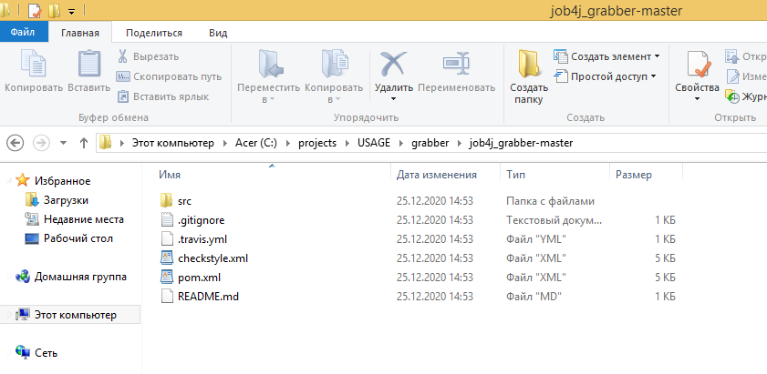
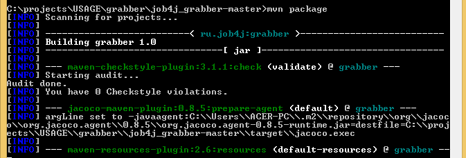

# Проект - Grabber

# Содержание
* [Использованные технологии](#Использованные-технологии)
* [О проекте](#О-проекте)
* [Сборка](#Сборка)
* [Использование](#Использование)
* [Контакты](#Контакты)
## Использованные технологии
* JDBC
* PostgreSQL
* Библиотека Jsoup
* Планировщик заданий Quartz
* Collections Framework
* Sockets
* Классы из пакета java.time
* Java Functional Interfaces (java.util.function)
* Checkstyle plugin
* JaCoCo
* Travis CI
## О проекте
Проект представляет собой парсер вакансий. Парсинг вакансий осуществляется с сайта: 
[https://www.sql.ru/forum/job-offers](https://www.sql.ru/forum/job-offers). 
В проект также можно добавить новые сайты без изменения кода.  
Все распарсенные вакансии преобразуются в модели данных и хранятся в БД PostgreSQL.  
Система запускается по расписанию, (данная функция реализована с помощью планировщика заданий Quartz), 
т. е. по истечению каждого периода запуска парсятся 3 страницы сайта вакансий и с помощью JDBC складируются в БД. 
Период запуска указывается в настройках - в файле app.properties.  
Доступ к интерфейсу сайта осуществляется через REST API с помощью библиотеки Jsoup (парсинг HTML).  
В отдельном потоке также запускается сервер (реализованный на ServerSocket) 
на порту указанном в файле настроек app.properties. Обратившись по данному порту можно получить список всех распарсенных вакансий 
(т. е. список вакансий, хранящихся в БД).  
Общая диаграмма зависимостей компонентов:  
  
1. Интерфейсы __*Grab*__, __*Store*__, __*Parse*__ - через данные интерфейсы осуществляется связь между всеми классами программы, 
за счёт чего достигается расширяемость системы.
2. Класс __*Post*__ - модель данных, включающая в себя id, название, описание, ссылку, а также дату создания вакансии.
3. Класс __*Grabber*__ - главный класс программы. Осуществляет инициализацию всех компонентов, запускает задачу на парсинг 
в соответствие с расписанием, указанным в файле настроек app.properties (посредством планировщика заданий *Quartz*), а также 
запускает сервер на *ServerSocket* в отдельном потоке для получения данных о распарсенных вакансиях.
4. Класс __*PsqlStore*__ - предназначен для работы с БД. Выполняет CRUD-операции над моделью данных через *JDBC*.
5. Класс __*SqlRuParse*__ - с помощью *библиотеки Jsoup* осуществляет непосредственный парсинг вакансий с сайта.
6. Класс __*ParseDate*__ - с помощью классов из пакета *java.time* и *Dispatch pattern* преобразовывает дату создания вакансии 
к необходимому для сохранения в БД формату.
## Сборка
1. Установить JDK 14.
2. Скачать Maven.
3. Создать переменные окружения JAVA_HOME и M2_HOME и прописать в переменную окружения Path 
пути до бинарных файлов для JDK и для Maven:  
  
4. Установить сервер БД PostgreSQL. При установке задать: имя пользователя - postgres, 
пароль - root, порт - 5432. Также при установке сервера БД PostgreSQL нужно установить программу pg_Admin.
5. Скачать исходный код проекта с GitHub.
6. Перейти в корень проекта, где лежит файл pom.xml:  
 
  
7. С помощью Maven осуществить сборку проекта:  
  
При успешной сборке должна появиться папка target, в которой располагается jar-архив grabber.jar:  
 
 
  
8. Запустить сервер БД, указав путь до папки data:  
  
9. Запустить программу pg_Admin, установленную вместе с сервером БД PostgreSQL:  
  
10. Создать БД с названием grabber:  
  
11. Открыть Query Tool для созданной БД и запустить SQL-скрип create.sql, 
находящийся в папке src/main/data/sql (данная папка находится в корне скачанного проекта):  
 
 
## Использование
Теперь, когда jar-архив собран и БД подготовлена можно запускать jar-архив:  
 
 
  
Как видно, в БД появились распарсенные вакансии.  
Через указанное в файле настроек app.properties время (по умолчанию 30 секунд) произойдёт повторный парсинг вакансий:  
  
Как видно, БД пополнилась новыми вакансиями.  
Теперь можно получить список всех вакансий обратившись по порту, указанному в файле настроек (по умолчанию порт 2345):  
  
Данные отправляются сервером в кодировке UTF-8. Чтобы корректно отобразить данные нужно настроить браузер. 
В случае с Яндекс-браузером это можно сделать следующим образом:  
 
  
Как видно, теперь данные отображаются корректно.
## Контакты
Почта: studentnstu97@mail.ru 
Skype: live:.cid.9cdc925fb48220b4